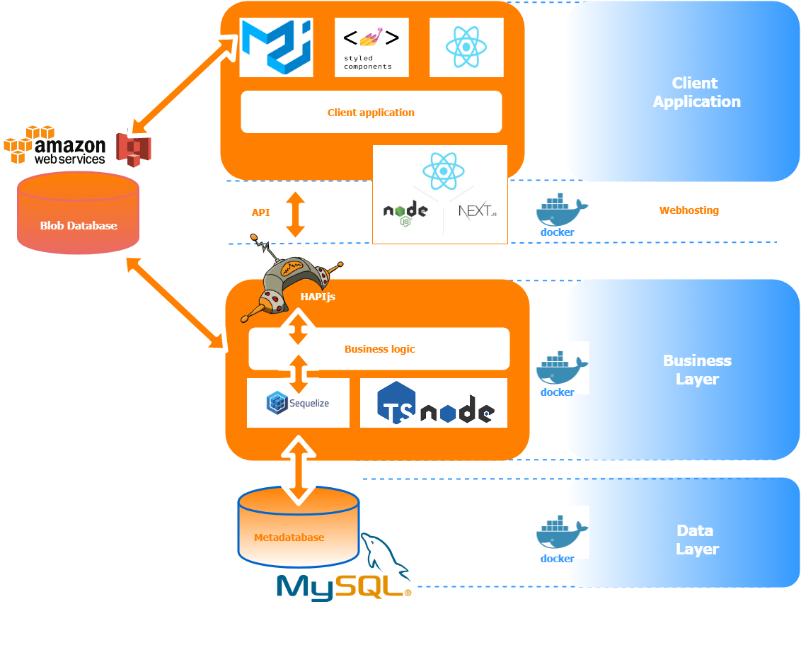
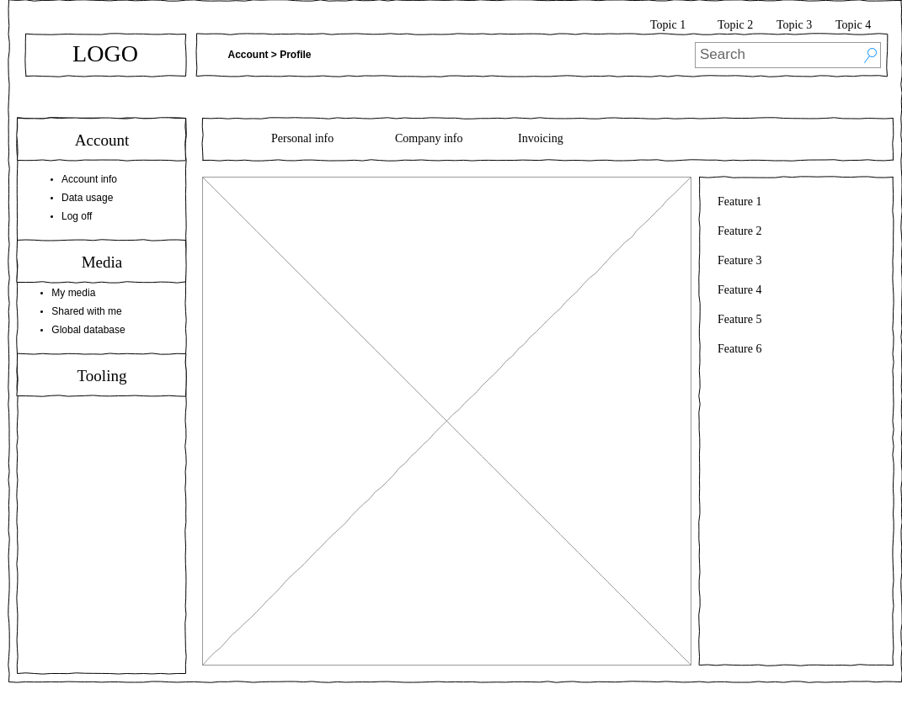
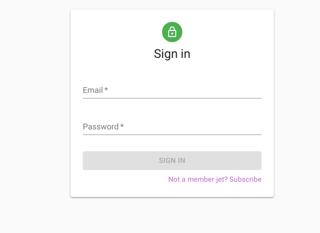

# Fieldwork media

Aim: Sharing large amount of indexed media

## Global docs

[Docs are here](docs/README.md)

## Server docs

[Docs are here](server/docs/README.md)

## Client docs

[Docs are here](client/README.md)

## POC

As a user:

1. I Want to upload a large jpg file through the api, and see it back in the GUI by a thumb
2. I want to be able to logon in my browser to the system and see my available media

## Roadmap POC

1. Setup environment
    - agree about tech stack and coding conventions
    - agree about first implemented cloud connector
    - IDE
    - git repo
    - docs and testing setup
2. Implement ERD model and API for the primary entities
3. Setup client UI
4. Implement logon sequence and security
5. Implement first cloud storage connection @backend
6. Setup basic commandline CLI to upload large file to cloud through API
7. Setup basic indexertool to create thumb
8. Implement basic client-side renderer to show thumb

## Next steps

1. add storage and transactionlog and billing
2. open for pilot-clients
3. start implementing other engines, connectors and clients

## Setup environment

### tech stack

### cloud connector

### screen development

